# Spec-Driven Development Plugin

A comprehensive multi-agent workflow for systematic software feature development - from requirements gathering through verified implementation.

## Overview

This plugin implements a structured approach to feature development that mirrors real-world software teams, with specialized agents handling different phases of the development lifecycle. It's designed to ensure high-quality implementations through clear specifications, systematic verification, and architectural coherence.

## What's Included

### Commands

- **`/prime-simple`** - Quick feature development with basic clarification (for simple features)
- **`/prime-spec`** - Full requirements gathering and specification creation (for complex features)
- **`/prime-tech`** - Technical design discussion to create implementation blueprint
- **`/prime-build`** - Coordinate implementation team to build approved specification
- **`/refine-spec`** - Refine and improve the spec-driven workflow itself

### Agents

- **`tdd-developer`** - Test-driven developer for implementation work
- **`code-reviewer`** - Elite code reviewer focused on patterns, type safety, test quality, and architectural consistency
- **`qa-spec-tester`** - QA tester to verify implementations against specifications

### Documentation

- **`docs/ways-of-working.md`** - Complete multi-agent architecture and workflow
- **`docs/specification-template.md`** - Template for feature specifications
- **`docs/writing-specs.md`** - Guide to writing effective specifications

### Spec Templates

- **`SPEC_TEMPLATE.md`** - Template for feature specifications
- **`TECH_SPEC_TEMPLATE.md`** - Template for technical design documents
- **`SPEC_PATTERNS.md`** - Document structure and naming conventions
- **`COMMUNICATION_PROTOCOL.md`** - Agent handover and reference standards
- **`get-next-spec-id.sh`** - Helper script to get next specification ID

## Workflows

### Simple Features

For straightforward features that don't require extensive planning:

```bash
/prime-simple Add user email validation to signup form
```

This workflow:
1. Creates a specification for documentation
2. Implements the feature directly
3. Tests the implementation
4. Delivers working code

### Complex Features - Full Workflow

For complex features requiring careful planning:

#### Phase 1: Requirements & Specification

```bash
/prime-spec Build a user authentication system with OAuth2
```

The architect agent will:
- Ask clarifying questions about requirements
- Use the Explore agent to find existing patterns
- Use the researcher agent to investigate best practices
- Create a comprehensive specification in `specs/`
- Get your approval before proceeding

Output: `specs/001-user-authentication.md` with clear requirements and acceptance criteria

#### Phase 2: Technical Design

```bash
/prime-tech specs/001-user-authentication.md
```

The architect agent will:
- Break down the feature into implementable tasks
- Make technology stack decisions
- Define data flows and component boundaries
- Create numbered implementation tasks
- Document trade-offs and rationale

Output: `specs/001-user-authentication.tech.md` with detailed implementation plan

#### Phase 3: Implementation

```bash
/prime-build specs/001-user-authentication.md
```

The architect coordinates:
- tdd-developer implements each task one at a time
- code-reviewer reviews for patterns, type safety, and test quality
- qa-spec-tester verifies against acceptance criteria
- Fixes are made until code review and QA both pass
- Progress is tracked by updating checkboxes in tech spec

Output: Verified, high-quality code that matches the specification

## Multi-Agent Architecture

```mermaid
graph TD
    User[User Request] --> Architect[🏗️ Architect/Prime<br/>Requirements & Design]

    Architect --> Researcher[🔬 Researcher<br/>Best Practices]
    Architect --> Explore[🗺️ Explore<br/>Code Discovery]

    Architect --> Spec[📋 Specification<br/>specs/YYYY-MM-DD-feature.md]

    Spec --> Dev[👨‍💻 TDD Developer<br/>Implementation]
    Dev --> Review[🔍 Code Reviewer<br/>Patterns & Quality]
    Review --> QA[✅ QA Tester<br/>Spec Verification]

    Review --> Dev
    QA --> Dev
    QA --> Architect

    Architect --> Commit[Git Commit]
```



### Agent Roles

- **Architect (Prime Agent)** - Technical leadership, requirements analysis, task delegation, quality oversight
- **Explore** - Fast codebase navigation and discovery
- **Researcher** - External knowledge acquisition and best practices
- **TDD Developer** - Code implementation following specifications
- **Code Reviewer** - Reviews for duplicate patterns, type safety, test quality, and architectural consistency
- **QA Spec Tester** - Verification of implementations against acceptance criteria

## Project Setup

### Required Directory Structure

Create a `specs/` directory in your project root:

```bash
mkdir specs
```

### Copy Templates (Optional)

Copy the spec templates to your project:

```bash
cp ~/.claude/plugins/spec-dev/spec-templates/* ./specs/
```

This gives you local copies of:
- `SPEC_TEMPLATE.md`
- `TECH_SPEC_TEMPLATE.md`
- `SPEC_PATTERNS.md`
- `COMMUNICATION_PROTOCOL.md`
- `get-next-spec-id.sh`

## Best Practices

### Do's

- ✅ Use agents proactively based on their strengths
- ✅ Maintain living documentation that evolves
- ✅ Always code review before QA testing (catches patterns, types, test issues)
- ✅ Verify everything through QA before marking complete
- ✅ Commit after each major milestone
- ✅ Break complex tasks into small, testable pieces

### Don'ts

- ❌ Skip code review to save time (prevents technical debt accumulation)
- ❌ Skip QA verification to save time
- ❌ Let the architect write code directly (delegate to developers)
- ❌ Proceed without clear specifications
- ❌ Batch multiple tasks together (implement one at a time)
- ❌ Allow direct communication between agents (route through architect)

## Choosing the Right Workflow

| Scenario | Command | Why |
|----------|---------|-----|
| Add form validation | `/prime-simple` | Straightforward, well-understood feature |
| Fix a bug | `/prime-simple` | Simple, isolated change |
| Add OAuth authentication | `/prime-spec` → `/prime-tech` → `/prime-build` | Complex, requires planning and design |
| Multi-service integration | `/prime-spec` → `/prime-tech` → `/prime-build` | Multiple components, dependencies |
| Refactor architecture | `/prime-spec` → `/prime-tech` → `/prime-build` | Significant impact, needs careful design |

## Quality Gates

Before marking any feature complete:

- ✅ Code review passed (no duplicate patterns, strong types, quality tests)
- ✅ All acceptance criteria verified by QA
- ✅ Code follows project conventions
- ✅ No test regressions (tests not removed or weakened)
- ✅ Type safety maximized (discriminated unions over optional fields)
- ✅ Error handling implemented and tested
- ✅ Performance requirements met
- ✅ Security considerations addressed
- ✅ Tests pass (if test suite exists)
- ✅ Linting/type checking passes

## Documentation

For complete details on the multi-agent architecture and workflows, see:

- **`docs/ways-of-working.md`** - Full system architecture and agent responsibilities
- **`docs/specification-template.md`** - How to structure specifications
- **`docs/writing-specs.md`** - Guide to writing effective specs

## Success Metrics

Track these to measure system effectiveness:

- **Specification Completeness**: % of features with full specs
- **First-Time Pass Rate**: % of implementations passing QA initially
- **Rework Rate**: Average iterations needed per feature
- **Time to Implementation**: From spec to verified code
- **Technical Debt Accumulation**: Items added vs resolved

## Evolution

This system should evolve based on:

1. **Usage Patterns** - Which agents are most/least effective
2. **Bottlenecks** - Where does the process slow down
3. **Quality Metrics** - Where do defects originate
4. **Team Feedback** - What's working and what's not

Use `/refine-spec` to suggest improvements to the workflow itself.

## Philosophy

This plugin prioritizes:

1. **Clear specifications** before implementation
2. **Specialized expertise** through dedicated agents
3. **Quality verification** at every step
4. **Architectural coherence** through central coordination
5. **Continuous improvement** through living documentation

The key to success is maintaining discipline in following the process while remaining flexible enough to adapt when requirements don't match reality.
