# Multi-Agent Architecture Ways of Working (WoW)

## Overview

This document describes the complete system for multi-agent collaboration in Claude Code, focusing on how specialized agents work together to deliver high-quality software implementations from initial requirements through to verified production code.

## System Architecture

```mermaid
graph TD
    User[User Request] --> Architect[🏗️ Architect/Prime<br/>Requirements & Design]

    Architect --> Researcher[🔬 Researcher<br/>Best Practices]
    Architect --> Explore[🗺️ Explore<br/>Code Discovery]

    Architect --> Spec[📋 Specification<br/>specs/YYYY-MM-DD-feature.md]

    Spec --> Dev[👨‍💻 Developer<br/>Implementation + Skills]
    Dev --> Review[🔍 Reviewer<br/>Static Analysis]
    Review --> QA[✅ Tester<br/>Functional Testing]

    Dev --> Architect
    Review --> Architect
    QA --> Architect

    Architect --> Commit[Git Commit]

    %% Theme classes for clarity and contrast
    classDef orchestrator fill:#2563eb,stroke:#1e3a8a,stroke-width:2px,color:#ffffff;
    classDef artifact fill:#facc15,stroke:#92400e,stroke-width:2px,color:#111111;
    classDef implement fill:#f59e0b,stroke:#7c2d12,stroke-width:2px,color:#111111;
    classDef review fill:#9333ea,stroke:#581c87,stroke-width:2px,color:#ffffff;
    classDef verify fill:#10b981,stroke:#065f46,stroke-width:2px,color:#111111;
    classDef research fill:#a78bfa,stroke:#4c1d95,stroke-width:2px,color:#111111;
    classDef discovery fill:#06b6d4,stroke:#0e7490,stroke-width:2px,color:#111111;
    classDef output fill:#cbd5e1,stroke:#0f172a,stroke-width:2px,color:#111111;

    class Architect orchestrator;
    class Spec artifact;
    class Dev implement;
    class Review review;
    class QA verify;
    class Researcher research;
    class Explore discovery;
    class Commit output;
```



## Agent Roles and Responsibilities

### 🏗️ Architect (Prime Agent)

**Role**: Technical leadership and system design  
**Model**: Opus (highest capability for complex reasoning)  
**Focus**: Requirements analysis, specification creation, task delegation, quality oversight

**Key Responsibilities**:

- Engage with users to extract clear requirements
- Create comprehensive technical specifications
- Delegate tasks to specialized agents
- Maintain architectural coherence
- Make final decisions on implementation approaches

**When Active**: Throughout the entire process as the orchestrator

### 🗺️ Explore

**Role**: Codebase navigation and discovery
**Model**: Fast agent for exploration tasks
**Focus**: Finding files by patterns, searching code, answering questions about codebase structure

**Key Responsibilities**:

- Find relevant code sections quickly using glob patterns and keyword search
- Answer questions about codebase structure and architecture
- Locate similar implementations and patterns
- Provide quick overviews of specific areas of code

**When Active**: During discovery phase and when implementation needs context

### 🔬 Researcher

**Role**: External knowledge acquisition  
**Model**: Haiku (fast retrieval and synthesis)  
**Focus**: Documentation, best practices, technical research

**Key Responsibilities**:

- Research industry best practices
- Find API documentation
- Investigate compliance requirements
- Understand unfamiliar technologies

**When Active**: During requirements gathering and when encountering unknown technologies

### 👨‍💻 spec-developer

**Role**: Code implementation with skill loading
**Model**: Sonnet (balanced capability and speed)
**Focus**: Translating specifications into working code using appropriate language/framework skills

**Key Responsibilities**:

- Load relevant skills before implementing based on tech stack
  - Examples: typescript, python, go, react, vue, django, etc.
  - Check what skills are available in the current repository
- Implement features according to specifications
- Follow language/framework conventions from loaded skills
- Ask clarifying questions when specs are ambiguous
- Handle edge cases and error scenarios

**When Active**: During implementation phase

### 🔍 spec-reviewer

**Role**: Static code analysis
**Model**: Sonnet (thorough analysis capability)
**Focus**: Reviewing code quality WITHOUT running it

**Key Responsibilities**:

- Search codebase for duplicate patterns
- Verify type safety (recommend discriminated unions over optional fields)
- Review test quality (ensure tests aren't weakened)
- Check architectural consistency with project conventions
- DOES NOT test functionality (that's spec-tester's role)

**When Active**: After implementation, before functional testing

### ✅ spec-tester

**Role**: Functional verification from user perspective
**Model**: Sonnet (thorough testing capability)
**Focus**: Actively testing features work as specified for users

**Key Responsibilities**:

- Load testing skills appropriate for what's being tested
  - Examples: playwright-skill (web UIs), pdf/xlsx/docx/pptx (documents), etc.
  - Check what testing skills are available in the current repository
- Test from user perspective (web UI user, API consumer, module user)
- Verify functional requirements (FR-X) through actual usage
- Test non-functional requirements (NFR-X) where measurable
- Provide evidence (screenshots, API responses, observed behavior)
- DOES NOT review code quality (that's spec-reviewer's role)

**When Active**: After code review passes

## Standard Workflow

### 1. Initiation

```bash
/build "Build a user authentication system"
```

The architect agent is activated with enhanced context and begins requirements gathering.

### 2. Discovery Phase

The architect:

- Asks clarifying questions to understand requirements
- Delegates to researcher for best practices
- Delegates to Explore agent for existing patterns
- Synthesizes findings into requirements

### 3. Specification Phase

The architect creates a detailed specification in `specs/<id>-<feature>/feature.md` using the SPEC_TEMPLATE, containing:

- Problem statement and value proposition
- Functional requirements with testable ACs
- Non-functional requirements (performance, security)
- Interface definitions and data models
- Clear acceptance criteria
- External dependency validation (pre-flight checks)
- Technical debt tracking

### 4. Implementation Phase

Iterative cycle with distinct quality gates:

```
Architect → Developer (implement task, load skills)
Developer → Architect (implementation complete)

Architect → Reviewer (static analysis)
Reviewer → Architect (code quality report)
If blocking issues → Resume Developer → Rereview

Architect → Tester (functional verification from user perspective)
Tester → Architect (functional test report)
If fails → Resume Developer → Rereview → Retest

Architect → Mark task complete in tech.md
Architect → Commit (after all gates passed)
```

**Key distinction**:
- **Reviewer**: Static analysis (pattern duplication, type safety, test quality)
- **Tester**: Functional verification (does it work from user perspective?)

### 5. Quality Gates

Before marking any task complete, ensure BOTH gates pass:

**Gate 1: Code Review (Static Analysis)**
- ✅ No duplicate patterns without justification
- ✅ Type safety maximized (discriminated unions over optional fields)
- ✅ Test quality maintained (no test regressions)
- ✅ Code follows project conventions
- ✅ Architectural consistency

**Gate 2: Functional Testing (User Perspective)**
- ✅ All acceptance criteria verified through actual usage
- ✅ Feature works from user perspective (web UI, API, module)
- ✅ Error handling works as specified
- ✅ Performance requirements met (where measurable)
- ✅ Evidence provided (screenshots, API responses, behavior observed)

## Communication Protocols

### Task Delegation Format

```yaml
Task_Specification:
  id: "auth-implementation"
  type: "coding"
  priority: "high"
  context:
    background: "User authentication for SaaS"
    constraints: "Must support 10K users"
  requirements:
    - "Implement JWT authentication"
    - "Add refresh token mechanism"
  success_criteria:
    - "All endpoints return tokens"
    - "Tokens expire correctly"
```

### Agent Response Format

Each agent provides structured responses:

- **File locations** with line numbers
- **Pass/fail status** for requirements
- **Specific issues** with fixes
- **Impact analysis** for changes

### Communication Routing Rules

- Developer, Reviewer, and Tester do NOT communicate directly with each other.
- All findings and clarifications are sent to the Architect.
- The Architect relays tasks, feedback, and decisions back to agents.
- Purpose: preserve a single source of truth and architectural coherence.

**Workflow routing**:
```
Developer → Architect → Reviewer → Architect → Tester → Architect
                ↓                    ↓                    ↓
         (if issues)           (if issues)          (if issues)
                ↓                    ↓                    ↓
           Resume Developer    Resume Developer     Resume Developer
```

Note: This routing reflects Claude Code's subagent model. Agent-to-agent communication is not supported - Architect maintains central coordination.

## Why No Dedicated Analyst Agent?

After careful consideration, we've chosen NOT to include a separate analyst agent because:

### Current Approach Benefits

1. **Context Preservation**: The architect directly gathers requirements, maintaining full context for design decisions
2. **Immediate Technical Feedback**: Can identify technical impossibilities during requirements gathering
3. **Token Efficiency**: Avoids duplicating context between analyst and architect
4. **Faster Iteration**: No handoff delays between analysis and design

### When an Analyst WOULD Add Value

Consider adding an analyst agent when:

- **Enterprise Scale**: Formal business analysis with multiple stakeholder groups
- **Regulatory Compliance**: Specialized domain knowledge required (healthcare, finance)
- **Complex User Research**: Extensive user interviews and journey mapping needed
- **Architect Overload**: Multiple concurrent projects requiring parallel requirements gathering

### Future Enhancement Path

If adding an analyst agent:

```mermaid
graph LR
    User --> Analyst[📊 Analyst]
    Analyst --> BRD[Business Requirements]
    BRD --> Architect
    Architect --> TechSpec[Technical Spec]
```



The analyst would:

- Focus on business requirements and user stories
- Create BRDs (Business Requirements Documents)
- Handle stakeholder management
- Pass refined requirements to architect

## Best Practices

### Do's

- ✅ Use agents proactively based on their strengths
- ✅ Maintain living documentation that evolves
- ✅ Delegate implementation work to specialized agents
- ✅ Verify everything through QA before marking complete
- ✅ Commit after each major milestone

### Don'ts

- ❌ Skip code review or functional testing to save time
- ❌ Let the architect write code directly
- ❌ Create agents that overlap responsibilities
- ❌ Confuse reviewer (static analysis) with tester (functional verification)
- ❌ Skip skill loading for developers (check available language/framework skills)
- ❌ Let tester only read code without actually testing it
- ❌ Assume specific skills exist - always check what's available in the repository
- ❌ Ignore technical debt - document it
- ❌ Proceed without clear specifications
- ❌ Allow agents to coordinate directly — always route via Architect

## Metrics and Success Indicators

Track these to measure system effectiveness:

- **Specification Completeness**: % of features with full specs
- **First-Time Pass Rate**: % of implementations passing QA initially
- **Rework Rate**: Average iterations needed per feature
- **Time to Implementation**: From spec to verified code
- **Technical Debt Accumulation**: Items added vs resolved

## Evolution and Maintenance

This system should evolve based on:

1. **Usage Patterns**: Which agents are most/least effective
2. **Bottlenecks**: Where does the process slow down
3. **Quality Metrics**: Where do defects originate
4. **Team Feedback**: What's working and what's not

Regular reviews should assess whether:

- New specialized agents would add value
- Existing agents need role refinement
- Communication protocols need adjustment
- Quality gates are appropriate

## Conclusion

This multi-agent architecture mirrors real-world software teams, with clear roles, responsibilities, and communication protocols. The key to success is maintaining discipline in following the process while remaining flexible enough to adapt when requirements don't match reality.

The system prioritizes:

1. **Clear specifications** before implementation
2. **Specialized expertise** through dedicated agents
3. **Quality verification** at every step
4. **Architectural coherence** through central coordination
5. **Continuous improvement** through living documentation
