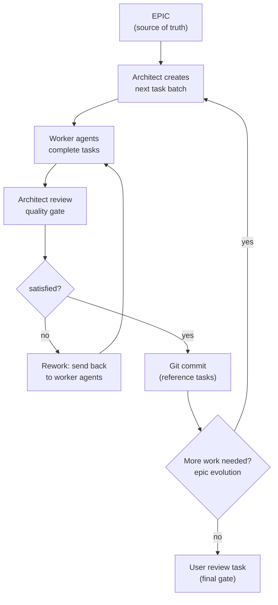

# Beads Development Workflow

A strict plan → build process using beads (`bd` CLI) for task management and multi-agent execution.

## Prerequisites

- `bd` CLI installed and available on `$PATH`
- Git repository initialised with a base branch (e.g. `main`)

## Two Phases

### Phase 1: Planning (no beads, no task tracking)

Freeform dialogue to thoroughly understand the problem before committing to execution.

- **Explore**: read relevant code, ask questions, gather requirements
- **Experiment**: write throwaway proof-of-concepts, run commands, add small tests to validate assumptions
- **Dispose**: all exploratory artefacts are removed once they've served their purpose — nothing from this phase is kept in the codebase
- **Document**: produce a final plan as a simple markdown file (default `Plan.md` in the project root, unless the repo uses a different planning-doc convention)

This phase does not use beads, planning tools, or task tracking. It is purely conversational and investigative.

### Phase 2: Execution (beads-driven)

Once the plan is finalised, execution follows a structured loop using beads for task management.

#### Setup

1. **Branch**: ensure work is on a fresh feature branch off the base branch (e.g. `main`). The branch starts clean — beads data is not tracked by git.
2. **Create the epic**: `bd create --type=epic` with the plan as its description. The epic is the single source of truth for the feature's intent and requirements.
3. **Create the user review task**: first task created, last one completed. Acts as a final gate for the user to verify the feature meets expectations. Never started until everything else is done.
4. **Create initial work tasks**: based on the epic, create the first 2–3 tasks to begin implementation.

#### Task Design

- **Ad hoc, not upfront**: do not break the entire epic into tasks at the start — they will drift from reality. Create tasks in small batches (2–3 at a time) as work is planned.
- **Chunky, not granular**: tasks should be meaningful units of work, not micro-steps. A single task can cover a significant piece of functionality.
- **Domain-scoped**: each task should relate to one area of concern (e.g. backend and frontend changes for the same feature are separate tasks). But not every change needs its own task — group logically.
- **Start large**: prefer larger tasks initially. Break future tasks down further if they prove too broad.

#### The Execution Loop

Alternates between **worker agents** (stateless, task-focused) and an **architect agent** (stateful, epic-aware).

**Worker agents** are stateless. They pick up tasks from `bd ready`, complete them, and report back. They have full context from the task description and can see the parent epic via `bd show`. They do not need to understand the broader plan beyond their task scope.

**The architect agent** is stateful and responsible for:

- **Quality gate**: reviewing completed work before committing. If work doesn't meet standards — code doesn't align with planned interfaces, test structure is wrong, or it drifts from the intended architecture — send it back to workers. Only commit once satisfied.
- **Epic evolution**: if workers discover something that changes the approach (e.g. a planned library doesn't work but a viable alternative exists), the architect can adapt the epic and create new tasks. This is distinct from quality issues — it's about the plan evolving, not substandard work.
- Creating the next batch of tasks based on what remains.
- Escalating to the user only when a deviation fundamentally contradicts the original requirements.

#### Git Workflow During Execution

- Stage and commit after the architect is satisfied with a task batch
- Reference beads task IDs in commit messages for traceability between git history and beads
- This creates a reviewable trail where commits map to approved, completed tasks — even though beads data itself is not in git

#### Autonomy and Escalation

This process is designed to be autonomous. The user should not need to be involved between the planning phase and the user review task. The architect agent drives progress independently.

Escalate to the user only when:

- A blocker is encountered that fundamentally contradicts the epic's intent and cannot be resolved by adjusting the implementation approach
- A significant scope change is needed that would alter the original requirements

It is acceptable for the architect to evolve implementation details, adjust the technical approach, and even update the epic's description — as long as the original requirements and user intent are preserved. The plan is a living document; the requirements are not.
